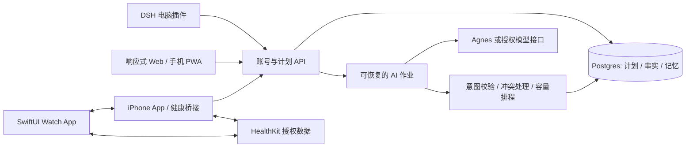

# 每日计划：电脑、手机与 Apple Watch 改造路径

设计日期：2026-10-02。本文是实施方案；本轮没有创建云服务、账号系统或 Watch App。

目标是同一份计划、记录和个人记忆，从电脑规划、手机口述复盘、手表快速记录进入同一条联动流程。建议顺序：共享核心和账号后端 → 手机 Web/PWA → iPhone 健康桥接 → Watch 原生端。电脑关机后，手机仍应能查看和修改计划，因此最终的数据与 AI 执行服务不能依赖电脑上的 DSH 一直打开。

## 本轮先完成的桌面改进

- 未来活动可以使用估算的日期/时段，按普通日程展示；内部保留推算依据供后续调整，不显示「暂定」标签。没说结束时间不再自动丢弃整项活动；预览可修改名称、时间和备注。
- Agnes 提取顺序、转场、模糊的时间词与可能参加的活动；服务检查估算时段，避开固定、完成和已开始记录。容量确实不足时保留冲突提示，不能偷偷挪成不符合描述的时段。
- 已发生的学习数量、健身重量/次数与完成记录仍需事实依据。估算只用于未来意图。
- 应用后继续显示输入区、原有模式和当前未来安排；跨周展望在重新打开后仍可查看，并可继续文字调整。
- 模型返回 `endMinute: null`、字符串形式的 `gymAdvice` 可做边界规范化；其他不可信的实际数量仍拒绝记录。

## 推荐的三端结构

这里是建议架构，不代表已有账号和云同步。Watch 初期以 iPhone 为同步桥梁，后续再考虑手表独立联网；不要把三个端各自生成的日历互相覆盖。

建议首版使用现有 React/TypeScript 前端、Node 服务、Postgres 数据库和托管账号服务。Supabase Auth + Postgres 可以减少自用阶段的账号管理工作；数据库仍需按用户隔离数据，服务端写入不能依赖前端传来的用户 ID。采用 Supabase 时按官方 RLS 机制限制每个账号的读写；AI 密钥与服务角色密钥留在服务端。[Supabase RLS](https://supabase.com/docs/guides/database/postgres/row-level-security)

部署组成：一个 HTTPS Web 域名、一套认证 API、一个数据库、一个 AI 作业执行器。前端可静态部署；AI 请求以作业方式提交，避免长请求中断导致“看起来没应用，其实部分保存”。开发、测试与个人正式数据分别存储，先完成备份恢复演练再导入原数据。

## 第一步：把插件的业务逻辑变成共享核心

当前插件的前端是 DSH 原生覆盖层，运行时依赖宿主 RPC；服务通过 DSH 存储域保存记录，Agnes 调用依赖原生会话运行时。不能只上传 `lib/client.js` 就得到可登录的网站。

| 现有入口 | 改造方向 |
| --- | --- |
| `src/domain.ts`、`adaptive.ts`、`clock.ts`、`appointmentEvidence.ts` | 提取为共享 domain 包，复用校验、日期、容量和时间估算逻辑 |
| `src/service.ts` | 分离 Repository、Clock、ModelGateway 与业务用例；解除对 Cordis Context 的直接依赖 |
| DSH `storageDomain` | 保留本地适配器；新增按 owner 隔离的 Postgres Repository 与事务 |
| `src/agnesJson.ts` | 保留桌面 Agnes 适配器；为云端新增受认证的模型接口适配器 |
| `src/client/runtime.ts` | 保留 DSH RPC；新增 HTTPS transport，复用前端状态与交互 |
| `src/client/shell/Root.tsx` | DSH 外壳与 standalone Web 外壳分开；核心日程、训练与复盘组件共用 |

**Agnes 的云端接入需要单独确认。** 当前可用的是 DSH 宿主提供的会话，不等于已取得可部署到服务器的 Agnes API。须有合法服务端接口与凭据后再接入。若暂时没有，可先用电脑上的受认证执行器作为自用过渡，清楚标注电脑离线时 AI 不可用；或接入用户已授权的云模型。客户端不放任何模型密钥。

完成标准：同一组业务测试同时通过本地 Repository 和数据库 Repository；日期、任务池、完成证据、跨周安排与个人记忆在两套适配器中得到相同结果。

## 第二步：账号后端与跨设备同步

账号先支持单个自用用户，关闭开放注册；登录、会话刷新、注销和设备解绑都走正规认证流程。不要用“知道网址”代替登录。

数据层新增 `owner_id`、稳定记录 ID、`revision`、操作 ID 与删除标记。计划、任务池、复盘、记忆和健身实际组数共用同步协议。推荐保留原桌面 ID，并将它们映射到账号空间；原 DSH domain version 仍保持 1，云数据库用独立迁移版本。

每次改动生成可追溯事件：哪个设备、哪段文字或哪次手动编辑、改了哪条记录。服务端按操作 ID 去重；网络失败重试和 Watch 重复送达不能累计两次重量组数或学习页数。离线写入先在本地 outbox 排队，重连后提交并拉取增量；删除采用 tombstone，避免旧设备把撤下的活动恢复。

同一用户的新文字优先于旧的未完成个人计划，但**不等于无条件覆盖另一个设备的更新**：AI 建议记录生成时的 revision，应用前复核；建议过期则在新状态上重算或展示差异。固定课程、已完成事实、实际健身记录仍保护。

保留用户的 `Asia/Shanghai` 日历日期与时区，将时间点同时映射到 UTC；“明天”和“下周”按用户时区解释。实际事件保留发生时间和记录时间，离线补记不会变成今天的新训练。

迁移流程：插件导出 → 导入预览及数量校验 → 账号数据库 → 双端读取对比 → 开启写入。同步运行后使用云端作为共享事实来源，避免本地和云端同时独立重排。原始导出可用于回滚。

完成标准：电脑新建活动，手机登录后看见；手机改时间，电脑反映；两端离线和重复提交不产生重复项；数据只能被所属账号读取。

## 第三步：手机 Web / PWA

手机首页直接展示今天的安排和统一输入入口，底部保留「今天 / 本周 / 训练 / 告诉 Agnes」。周计划用可切换日期的日程条目，桌面继续使用完整周网格。训练提供点击加入、调组次与重量；保留桌面拖拽，手机操作不依赖拖拽。

“告诉 Agnes”在手机上可用独立页：模式与日期范围小一行、输入区优先、建议可编辑、应用后仍能继续输入。轻量展示最近一次变更和当前后续安排，明细渐进展开。小屏验收覆盖安全区、键盘弹出、输入焦点与离线草稿。

加入 manifest、图标、service worker 与版本提示，让手机可“添加到主屏幕”。离线可看最近同步的计划、记草稿与实际训练；AI 联动需联网，显示排队/完成/失败状态。

iOS/iPadOS 16.4 起，添加到主屏幕的 Web App 可在用户主动授权后使用 Web Push；通知可以在配对 Apple Watch 上显示。这能先提供提醒，但不是 Watch 上可编辑、记录训练的原生应用。[WebKit：主屏幕 Web App 与 Web Push](https://webkit.org/blog/13878/web-push-for-web-apps-on-ios-and-ipados/)

完成标准：手机添加到主屏幕后可登录、复盘、看完整安排、改时间、记录训练；离线记录重连后正确同步。电脑关机不影响在线规划服务。

## 第四步：iPhone 与 Apple Watch 原生联动

网页版继续作为主要规划界面，新增 iPhone Swift/SwiftUI 轻量 App 负责原生登录状态、HealthKit 授权与 Watch 同步。Watch 使用 SwiftUI，第一版只做三件事：看下一个事项、确认/推迟任务、快速记录当前动作的组次和重量；开始/结束训练与休息计时器可随后加入。

WatchConnectivity 适合配对 iPhone 和 Watch 的通信：最新计划快照用 `updateApplicationContext`，逐条训练记录等需保留的事件用 `transferUserInfo`；支持时可即时发消息，但不能假设另一端一直在线。同步协议需有稳定事件 ID、本地队列和服务端去重。[Apple：WatchConnectivity](https://developer.apple.com/documentation/WatchConnectivity/transferring-data-with-watch-connectivity)

HealthKit 需按类型申请用户授权，只上传用户允许的必要数据；心率、训练时长等可以为复盘提供依据，不能据此捏造“卧推40kg做了3组10次”。实际重量与次数继续由用户记录或口述补记。Watch 训练会话可以收集运动数据，应用必须正确结束会话，不能让计时继续运行形成错误记录。[Apple：HealthKit 授权](https://developer.apple.com/documentation/healthkit/authorizing-access-to-health-data)、[训练会话](https://developer.apple.com/documentation/HealthKit/running-workout-sessions)

针对忘记打勾：根据授权的训练记录提示“检测到今天一场训练，是否对应计划中的这次？”，一次确认后关联训练；没有可靠来源的普通任务仍保持未知。晚间可以把未知事项汇总成一次补记，不发送每个任务的重复催促。自然语言“这次训练完成了”可确认训练结束，但缺失的每组数据仍显示未记录。

原生开发与真机签名需要能运行所选 Xcode 的 macOS 环境；现有 Windows 电脑可以继续开发 Web 和后端，iPhone/Watch 构建与真机调试需要 Mac 环境。[Apple：Xcode 系统要求](https://developer.apple.com/xcode/system-requirements)

可以先用 Xcode Personal Team 做个人真机测试；免费签名的配置文件有效期为 7 天，需要重建安装，并有设备/App ID 等限制。后续需要稳定的测试分发、TestFlight 或 App Store 时再加入 Developer Program；具体 HealthKit/Watch 能力与签名组合需在原型阶段真机验证，不把免费签名当作全部能力的保证。[Apple：开发者账号与 Personal Team](https://developer.apple.com/help/account/basics/about-your-developer-account)

完成标准：手表离线记录两组训练，手机恢复连接后上传，电脑只显示两组；重复传输不加倍；手机离线和电脑关机时手表仍能查看缓存的当日安排；训练检测关联只生成一次记录。验证要用配对的 iPhone 与 Watch 真机，不能只看模拟器界面。

## 建议的验收场景

1. 手机输入“明天六点左右吃饭，晚上可能喝酒”，生成完整的两个时段，按普通日程展示；电脑看到相同安排。
2. 电脑把聚餐改为18:30，手机和手表刷新；尚未应用的旧 AI 建议不能把它改回去。
3. Watch 离线记录卧推40kg、两组各10次，之后重传三次；数据库与训练进步仍只计两组。
4. 手机复盘“昨天论文写完，英语没做，之后上午更合适”，完成、未完成和偏好分别存储，未来排程读取这次反馈。
5. 数据源无法读取、健康权限被拒绝、模型失败或设备离线时，明确显示状态，不把无数据解释成未完成。

最值得先做的下一项是**共享核心 + 账号后端的最小闭环**：两台设备登录、同步一条计划、提交一次文字安排、恢复一个失败作业。它通过之后，再把手机界面和手表交互接上去。
